# AQW Wiki Enhanced

**Everything the AQW Wiki was always meant to be.** The extension syncs
your inventory straight from your AQW account. Every item link shows
whether you already own it, every merge and quest recipe does the math
against what you actually have, and search finds any page as you type. The
Armory lays your entire collection out on one page with the sorting and
rarity filters the game never gave it. Hover an item name anywhere and its
art appears at your cursor. And the whole wiki finally looks the part,
pixel perfect on every page, with a proper dark mode forged in Shadowfall.

  <a href="https://chromewebstore.google.com/detail/aqw-wiki-enhanced/ckcaldfamdaffifbagggkdcmefgkiiop">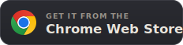</a>
  &nbsp;&nbsp;
  <a href="https://addons.mozilla.org/firefox/addon/aqw-wiki-enhanced/">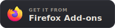</a>

Free and open source · GPL-3.0

  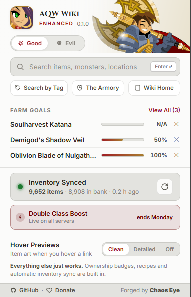
  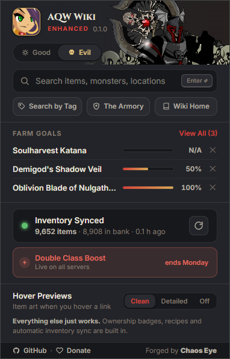

<em>One popup, two identities. Good keeps the wiki's library light. Evil is Shadowfall. Everything lives here.</em>

## It knows what you own

Sign into AQW Manage Account like you always do. The extension quietly reads
your inventory from your own session and re-syncs in the background. No
password, no login form, nothing typed anywhere, ever. From that moment every
item link on the wiki is colored: **green** means it's in your inventory,
**gold** means it's in the bank, with real quantities on hover. Legend, AC
and type variants resolve against the copies you actually own.

  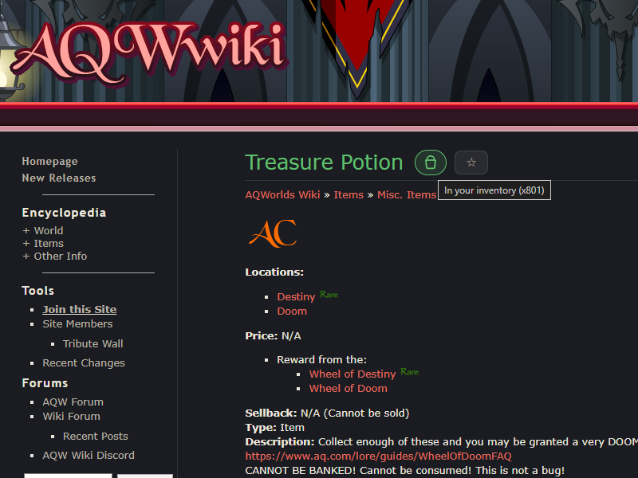
  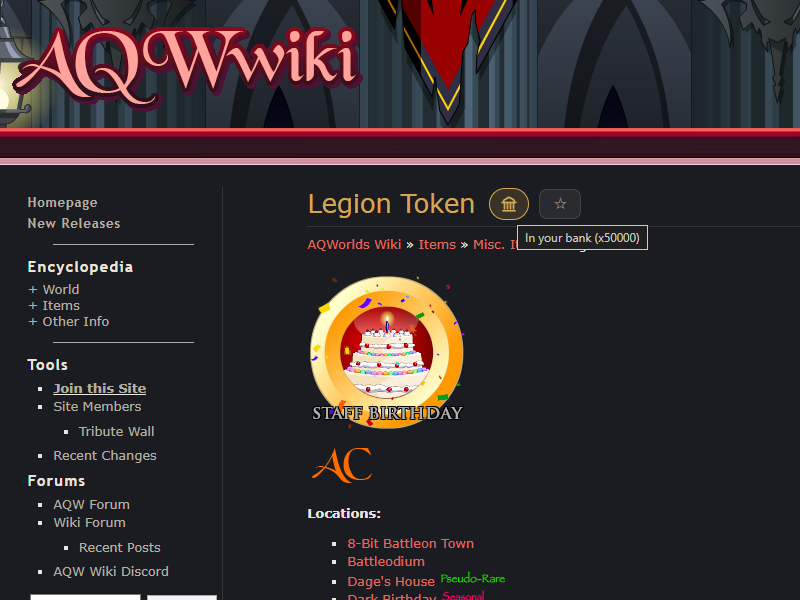

<em>Green with a bag: in your inventory. Gold with a vault: in your bank.</em>

## Recipes that do the math

Merge lists become live panels. Every material is clearly marked: ready to
merge, waiting in your bank, or still to farm, with your true counts and a
completion meter. And every way to obtain each material is right there:
price, drops, quests, merges, gifting, with the actual farming locations
linked underneath.

  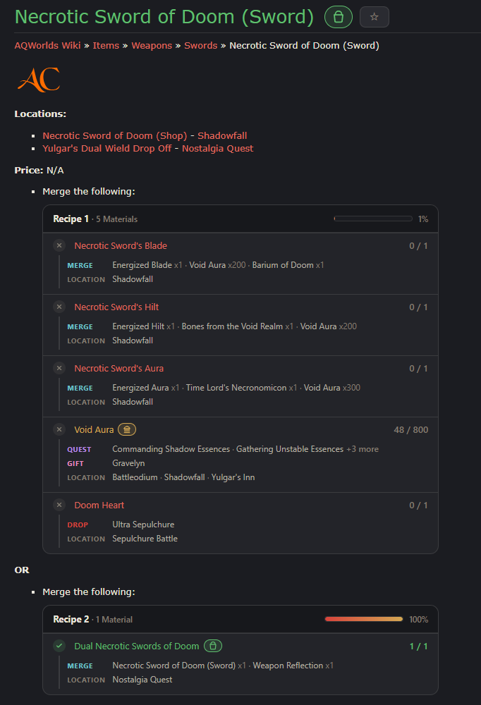

<em>The Necrotic Sword of Doom recipes, computed against a real inventory: every material carries its own sources and farming spots, and the meter tells you how close you are.</em>

Quest pages get the same treatment for their Items Required lists. Daily and
Weekly chips come straight from the quest's own fine print, drop monsters
bring their farming spots along, and even temporary quest items show where
they drop.

  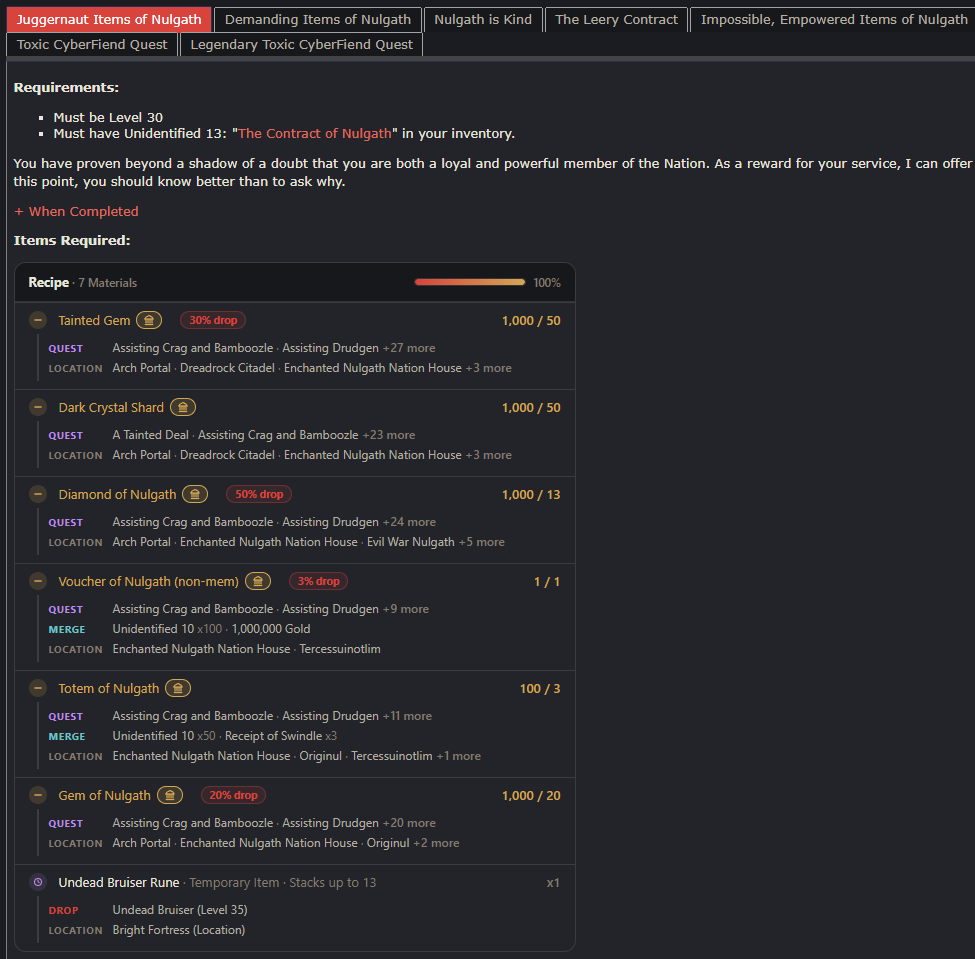
  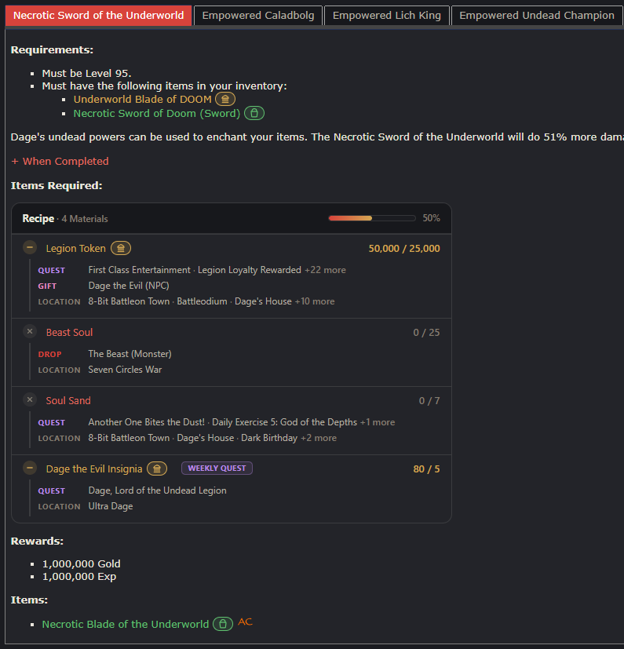

<em>Left: real drop rates with their monsters and locations. Right: a Weekly quest wears its chip and shows how many weeks of farming stand between you and the item.</em>

## The Armory

Every item you own on one page, in the game's own bag order, with the
search, sorting and rarity filters the bag never had. Sort by **Game Order,
Name, Rarity, Newest or Oldest**. Scope to Inventory or Bank. Filter by any
rarity in your collection. The **New** button shows everything you obtained
this week that isn't banked yet, so fresh drops stop vanishing into a
500 item bag.

  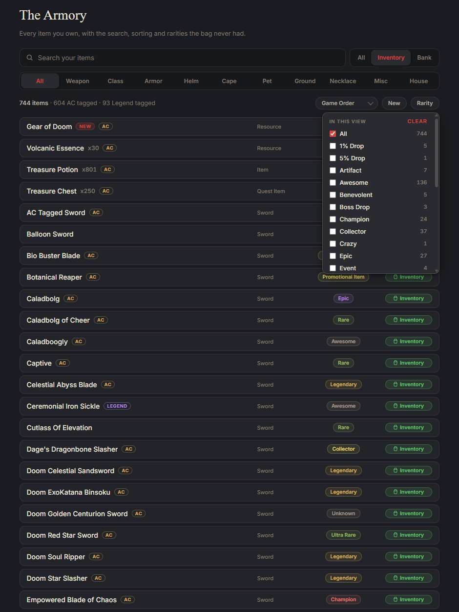
  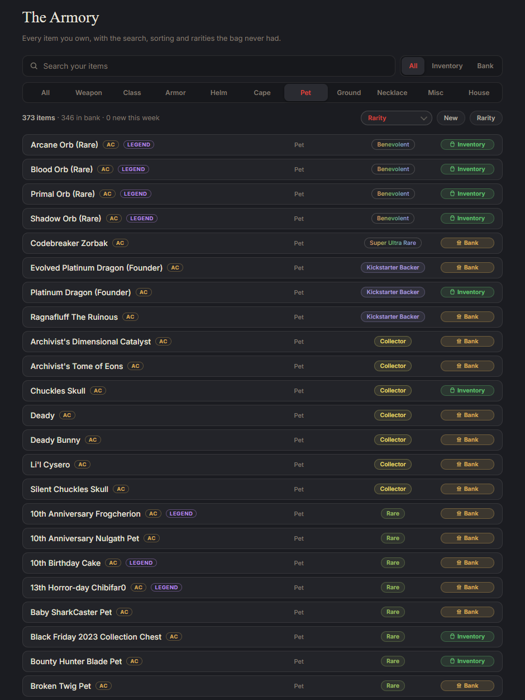
  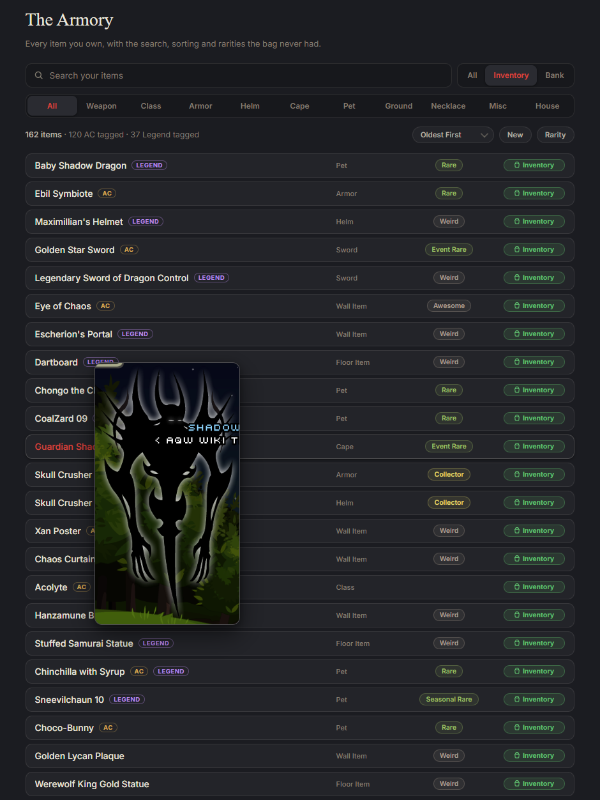

<em>Left: the rarity filter with live counts. Middle: sorted by rarity, the whole hierarchy in one scroll. Right: sorted by oldest, hover previews included.</em>

## Hover previews everywhere

Hover any item link and the art appears at your cursor. On the wiki, on your
character page, in any Manage Account table including the new Inventory and
IoDA select pages. Male and female art sit side by side where the wiki has
both. Clean or detailed, your choice.

  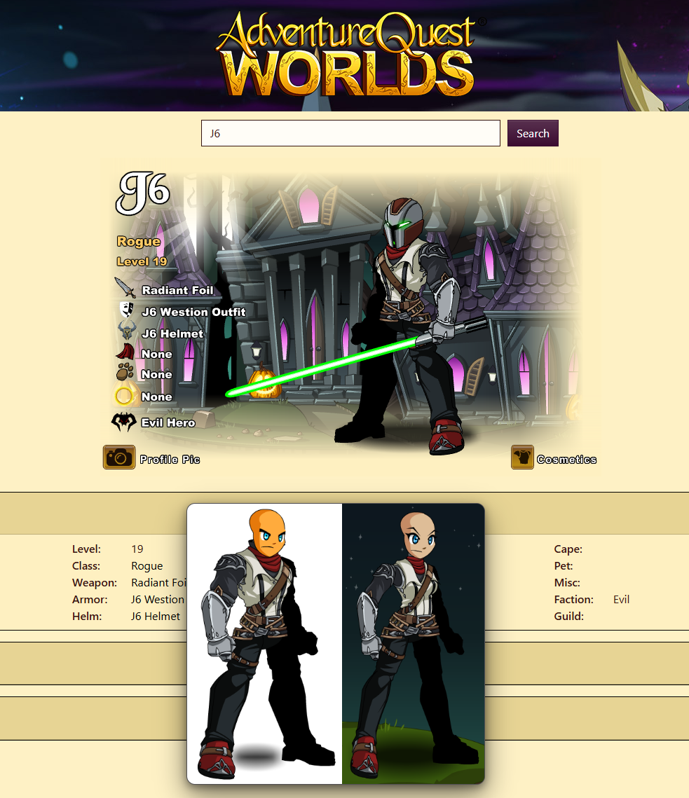
  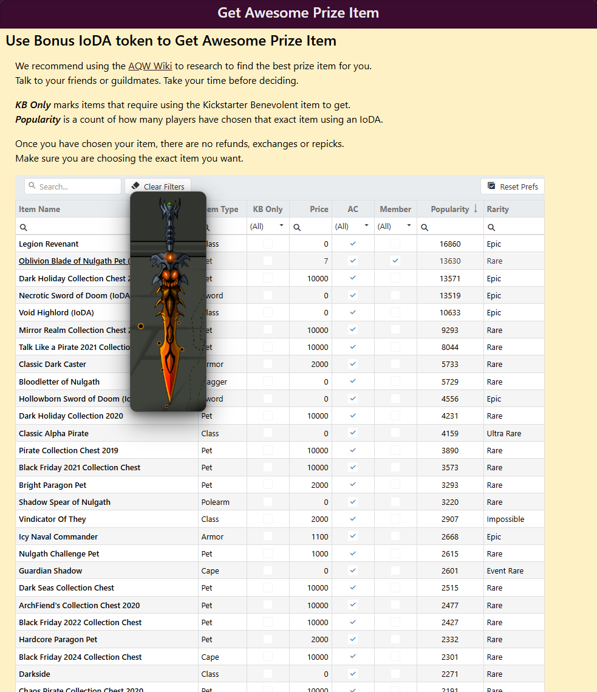
  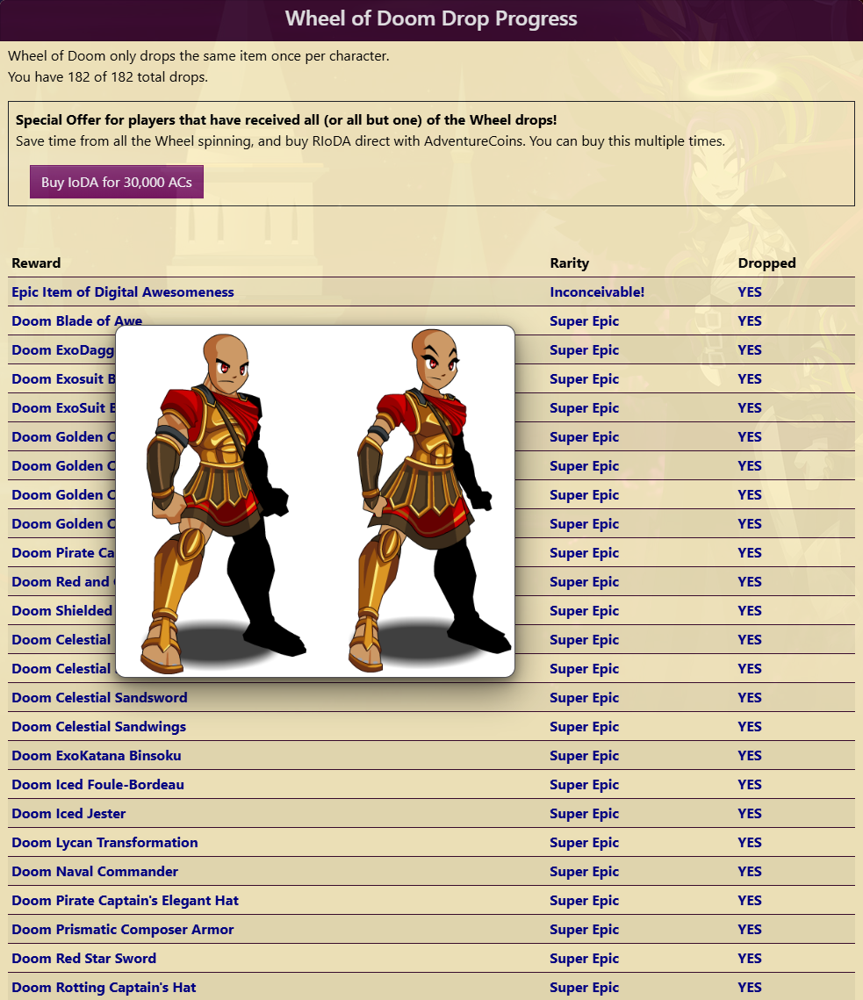

<em>Character pages, the IoDA select list, the Wheel of Doom table. If an item name appears, its art is one hover away.</em>

## Search that actually works

Finding things on the wiki has always been the hard part. Not anymore: the
popup searches the entire wiki as you type, instantly, and marks what you
already own right in the results. There is also a full Search by Tag builder
that speaks the official tag tool's exact grammar: category, order, gender,
per page, with suggestions at every step.

  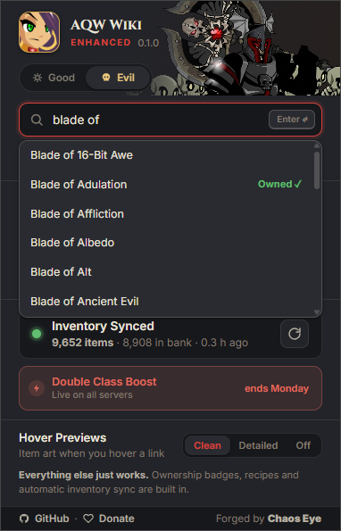
  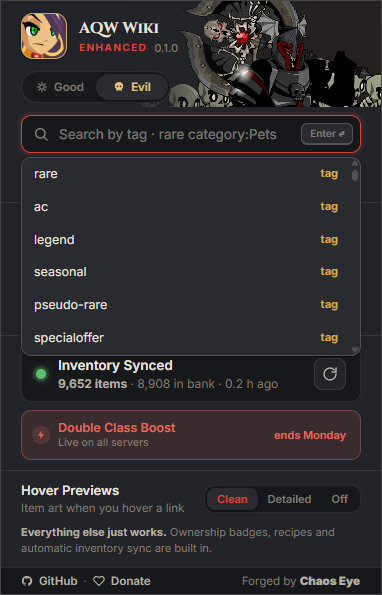

<em>Left: instant results with Owned marks. Right: the tag builder suggesting tags, categories and filters as you type.</em>

## And the rest

- **Farm Goals**: star any item, watch its recipe progress live in the popup.
- **Server Boosts**: the current Double boost and Thursday's resource boost,
  with real end days, straight from the Artix calendar.
- **Zero configuration**: no options page, no toggles to study. It just works.

## Privacy

Everything lives on your machine. The extension talks to exactly three
places: the wiki (pages you read), your own `account.aq.com` session
(inventory sync), and the public Artix calendar (boosts). Nothing else,
ever. Telemetry is opt-in and counts feature usage as anonymous weekly
numbers. No items, no account data, no identifiers. The entire server is
one small file you can read at
[tools/telemetry-worker.js](tools/telemetry-worker.js). The full privacy
policy lives in [docs/PRIVACY.md](docs/PRIVACY.md).

## Install

### 

For **Chrome, Edge, Brave and Opera GX**. One click from the store, and it
updates itself.

Prefer manual? Grab the Chromium zip from
[Releases](https://github.com/60GHz/aqw-wiki-enhanced/releases), unzip it,
open `chrome://extensions`, turn on Developer mode, hit *Load unpacked* and
pick the unzipped folder. Building from source works too: clone the repo and
load the `extension/` folder the same way, as-is.

### 

For **Firefox**. The store install is the permanent one and updates itself.

Manual loads (the Firefox zip from
[Releases](https://github.com/60GHz/aqw-wiki-enhanced/releases), via
`about:debugging` → *Load Temporary Add-on*) last until the browser
restarts. That is a Firefox rule for unsigned add-ons. From source: run
`powershell -File extension/build.ps1`, then load
`extension/dist/firefox/manifest.json` the same way.

If anything looks inert in Firefox, open `about:addons` → AQW Wiki Enhanced
→ *Permissions* and grant access to **aqwwiki.wikidot.com**,
**account.aq.com** and **artix.com**. Firefox treats site access as optional.

## Credits

This project stands on the shoulders of two community extensions:
[**AqwDoIhave**](https://github.com/DragoNext/AqwDoIhave) (ownership
checking and the Good/Evil banner concept) and
[**AQWikiTools**](https://github.com/R41CY/AQWikiTools) (server boosts, and
the item dataset this project first built on). Thank you both. And thanks to
the wiki's volunteer editors, who are the reason any of this matters.

Forged by **Chaos Eye**. Not affiliated with Artix Entertainment or the AQW
Wiki staff.

## License

GPL-3.0. Fork it, improve it, learn from it. Derivatives must stay open
source under the same license.
